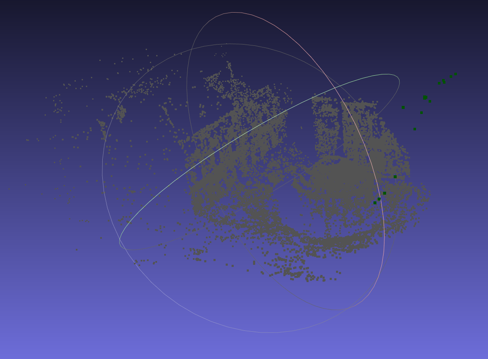

# Bundle Adjustment

| Before optimization | After optimization |
| ------------------- | ------------------ |
|      |      |

## BAL dataset

Observations are 2 * num_observations long array observations.

```
[u_1, u_2, ... u_n],
```

where each u_i is two dimensional, the x and y position of the observation.

## Bundle Adjustment and Graph Optimization

Bundle Adjustment refers to optimizing both camera parameters (intrinsic and extrinsic) and 3D landmarks with images.

- Given the multiple camera states and observations, find the optimal motion states

### Projection Model and Cost Function

Starting from a point \mathbf{p} in the world coordinate system.

1. Transform the world coordinates into the camera frame using extrinsics ($ \mathbf{R}, \mathbf{t} $)
   $$
   \mathbf{P}' = \mathbf{R} \mathbf{p} + \mathbf{t} = [X', Y', Z']^T.
   $$

2. Project $ \mathbf{P}'$ into the normalized plane and get the normalized coordinates:

$$
\mathbf{P}_c = [u_c, v_c, 1]^T = [X'/Z', Y'/Z', 1]^T. 
$$

3. Apply the distortion model. We only consider the radical distortion here:
   $$
   \left\{ \begin{array}{l} u_c' = {u_c}\left( {1 + {k_1}r_c^2 + {k_2}r_c^4} \right)\\ v_c' = {v_c}\left( {1 + {k_1}r_c^2 + {k_2}r_c^4} \right) \end{array} \right. .
   $$
   
5. compute the pixel coordinates using intrinsics:

   $$
   \left\{ \begin{array}{l} {u_s} = {f_x}u_c' + {c_x}\\ {v_s} = {f_y}v_c' + {c_y} \end{array} \right. .
   $$

This process is called *observation equation*
$$
\mathbf{z} = h(\mathbf{x}, \mathbf{y}).
$$
The landmark $\mathbf{y}$ is the three-dimensional point $\mathbf{p}$ here, and the observation data is the pixel coordinate $\mathbf{z}  = [u_s, v_s]^T$ . Consider from the perspective of least-squares The error:
$$
\mathbf{e} = \mathbf{z} - h(\mathbf{T}, \mathbf{p}).
$$
Suppose $\mathbf{z}_{ij}$ is the data generated by observing landmark $\mathbf{p}_j $at the pose $\mathbf{T}_i$, then the overall $\textit{cost function}$ is:
$$
\frac{1}{2}\sum_{i=1}^m \sum_{j=1}^n \| \mathbf{e}_{ij} \|^2 = \frac{1}{2}\sum_{i=1}^m\sum_{j=1}^n \| \mathbf{{z}}_{ij} - h(\mathbf{T}_{i},\mathbf{p}_j) \|^2 .
$$

### Solving Bundle Adjustment

camera pose variables:
$$
\mathbf{x}_c=[ \mathbf{\xi}_1, \mathbf{\xi}_2, \ldots, \mathbf{\xi}_m ]^T \in \mathbb{R}^{6m},
$$
landmarks:
$$
\mathbf{x}_p=[ \mathbf{p}_1, \mathbf{p}_2, \ldots , \mathbf{p}_n ]^T\in \mathbb{R}^{3n},
$$
The objective function for nonlinear optimization method:
$$
\frac{1}{2} \left\Vert f(\mathbf{x}+ \Delta \mathbf{x} ) \right\Vert ^2 = \frac{1}{2} \left\Vert \mathbf{e} + \mathbf{F}\Delta \mathbf{x}_c + \mathbf{E} \Delta \mathbf{x}_p \right \Vert ^2 .
$$


## Solve BA with Ceres

SolveBA function

```c++
for each observation:
	ceres::CostFunction *cost_function;
	
	// each residual block takes a point and a camera as input, 
	//and outputs a 2 dimensional residual
	cost_function = SnavelyReprojectionError::Create(observations[2 * i + 0], observations[2 * i + 1]);

	// Huber's loss function
     ceres::LossFunction *loss_function = new ceres::HuberLoss(1.0);

     // Each observation corresponds to a pair of a camera and a point
     // which are identif            ied by camera_index()[i] and point_index()[i]
     // respectively.
     double *camera = cameras + camera_block_size * bal_problem.camera_index()[i];
     double *point = points + point_block_size * bal_problem.point_index()[i];

     problem.AddResidualBlock(cost_function, loss_function, camera, point);
```


## Solve for BA with g2o 

1. Define vertex and edge

   ```c++
   // vertex point type : dimension, data type
   class VertexPoint : public g2o::BaseVertex<3, Vector3d> {
   public:
       EIGEN_MAKE_ALIGNED_OPERATOR_NEW;
   
       VertexPoint() {}
   
       // reset
       virtual void setToOriginImpl() override {
           _estimate = Vector3d(0, 0, 0);
       }
   
       // update
       virtual void oplusImpl(const double *update) override {
           _estimate += Vector3d(update[0], update[1], update[2]);
       }
   
       // read / write
       virtual bool read(istream &in) {}
   
       virtual bool write(ostream &out) const {}
   };
   ```

   ```c++
   // camera's pose and intrinsics, first 3 values is so3, the rest is t, f, k1, k2
   class VertexPoseAndIntrinsics : public g2o::BaseVertex<9, PoseAndIntrinsics> {
   public:
       EIGEN_MAKE_ALIGNED_OPERATOR_NEW;
   
       VertexPoseAndIntrinsics() {}
   
       // reset
       virtual void setToOriginImpl() override {
           _estimate = PoseAndIntrinsics();
       }
     
       // update
       virtual void oplusImpl(const double *update) override {
           _estimate.rotation = SO3d::exp(Vector3d(update[0], update[1], update[2])) * _estimate.rotation;
           _estimate.translation += Vector3d(update[3], update[4], update[5]);
           _estimate.focal += update[6];
           _estimate.k1 += update[7];
           _estimate.k2 += update[8];
       }
   
       // project point based on estimation
       Vector2d project(const Vector3d &point) {
           Vector3d pc = _estimate.rotation * point + _estimate.translation;
           pc = -pc / pc[2];
           double r2 = pc.squaredNorm();
           double distortion = 1.0 + r2 * (_estimate.k1 + _estimate.k2 * r2);
           return Vector2d(_estimate.focal * distortion * pc[0],
                           _estimate.focal * distortion * pc[1]);
       }
   
       virtual bool read(istream &in) {}
   
       virtual bool write(ostream &out) const {}
   };
   ```

   ```c++
   // edge type : observation's dimension, type, vertexPoint
   class EdgeProjection :
       public g2o::BaseBinaryEdge<2, Vector2d, VertexPoseAndIntrinsics, VertexPoint> {
   public:
       EIGEN_MAKE_ALIGNED_OPERATOR_NEW;
   
       // compute error
       virtual void computeError() override {
           auto v0 = (VertexPoseAndIntrinsics *) _vertices[0];
           auto v1 = (VertexPoint *) _vertices[1];
           auto proj = v0->project(v1->estimate());
           _error = proj - _measurement;
       }
   
       // use numeric derivatives
       virtual bool read(istream &in) {}
   
       virtual bool write(ostream &out) const {}
   
   };
   ```

   

2. graph

   ```c++
   /// build g2o problem
   const double *observations = bal_problem.observations();
   // vertex
   vector<VertexPoseAndIntrinsics *> vertex_pose_intrinsics;
   vector<VertexPoint *> vertex_points;
   // camera points
   for (int i = 0; i < bal_problem.num_cameras(); ++i) {
     VertexPoseAndIntrinsics *v = new VertexPoseAndIntrinsics();
     double *camera = cameras + camera_block_size * i;
     v->setId(i);
     v->setEstimate(PoseAndIntrinsics(camera));
     optimizer.addVertex(v);
     vertex_pose_intrinsics.push_back(v);
   }
   // landmark points
   for (int i = 0; i < bal_problem.num_points(); ++i) {
     VertexPoint *v = new VertexPoint();
     double *point = points + point_block_size * i;
     v->setId(i + bal_problem.num_cameras());
     v->setEstimate(Vector3d(point[0], point[1], point[2]));
     // manually set Marginalized vertex
     v->setMarginalized(true);
     optimizer.addVertex(v);
     vertex_points.push_back(v);
   }
   
   // edge
   for (int i = 0; i < bal_problem.num_observations(); ++i) {
     EdgeProjection *edge = new EdgeProjection;
     edge->setVertex(0, vertex_pose_intrinsics[bal_problem.camera_index()[i]]);
     edge->setVertex(1, vertex_points[bal_problem.point_index()[i]]);
     edge->setMeasurement(Vector2d(observations[2 * i + 0], observations[2 * i + 1]));
     edge->setInformation(Matrix2d::Identity());
     edge->setRobustKernel(new g2o::RobustKernelHuber());
     optimizer.addEdge(edge);
   }
   ```

3. select optimizer

   ```c++
   // pose dimension 9, landmark is 3
   typedef g2o::BlockSolver<g2o::BlockSolverTraits<9, 3>> BlockSolverType;
   typedef g2o::LinearSolverCSparse<BlockSolverType::PoseMatrixType> LinearSolverType;
   // use LM
   auto solver = new g2o::OptimizationAlgorithmLevenberg(
           g2o::make_unique<BlockSolverType>(g2o::make_unique<LinearSolverType>()));
   g2o::SparseOptimizer optimizer;
   optimizer.setAlgorithm(solver);
   optimizer.setVerbose(true);
   ```

4. optimize and return res

   ```c++
   // set to bal problem
   for (int i = 0; i < bal_problem.num_cameras(); ++i) {
     double *camera = cameras + camera_block_size * i;
     auto vertex = vertex_pose_intrinsics[i];
     auto estimate = vertex->estimate();
     estimate.set_to(camera);
   }
   for (int i = 0; i < bal_problem.num_points(); ++i) {
     double *point = points + point_block_size * i;
     auto vertex = vertex_points[i];
     for (int k = 0; k < 3; ++k) point[k] = vertex->estimate()[k];
   }
   ```