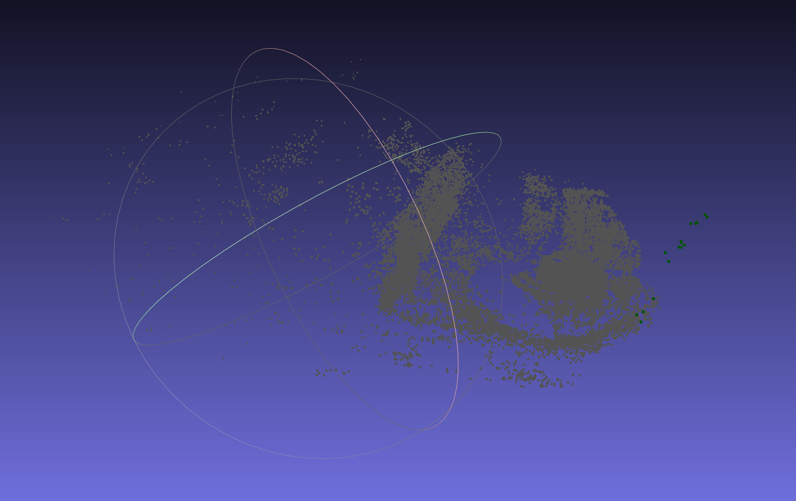

# Bundle Adjustment

Before optimization:



After optimization:


## BAL dataset

Observations are 2 * num_observations long array observations.

```
[u_1, u_2, ... u_n],
```

where each u_i is two dimensional, the x and y position of the observation.

## Bundle Adjustment and Graph Optimization

Bundle Adjustment refers to optimizing both camera parameters (intrinsic and extrinsic) and 3D landmarks with images.

- Given the multiple camera states and observations, find the optimal motion states

### Projection Model and Cost Function

Starting from a point $ \mathbf{p} $in the world coordinate system.

1. Transform the world coordinates into the camera frame using extrinsics ($ \mathbf{R}, \mathbf{t} $)
   
   $$
   \mathbf{P}' = \mathbf{R} \mathbf{p} + \mathbf{t} = [X', Y', Z']^T.
   $$

3. Project $ \mathbf{P}'$ into the normalized plane and get the normalized coordinates:

$$
\mathbf{P}_c = [u_c, v_c, 1]^T = [X'/Z', Y'/Z', 1]^T. 
$$

3. Apply the distortion model. We only consider the radical distortion here:
   
   $$
   \left\{ \begin{array}{l} u_c' = {u_c}\left( {1 + {k_1}r_c^2 + {k_2}r_c^4} \right)\\ v_c' = {v_c}\left( {1 + {k_1}r_c^2 + {k_2}r_c^4} \right) \end{array} \right. .
   $$
   

5. compute the pixel coordinates using intrinsics:

   $$
   \left\{ \begin{array}{l} {u_s} = {f_x}u_c' + {c_x}\\ {v_s} = {f_y}v_c' + {c_y} \end{array} \right. .
   $$

This process is called *observation equation*

$$
\mathbf{z} = h(\mathbf{x}, \mathbf{y}).
$$

The landmark $ \mathbf{y} $ is the three-dimensional point $\mathbf{p}$ here, and the observation data is the pixel coordinate $ \mathbf{z}  = [u_s, v_s]^T $ . Consider from the perspective of least-squares The error:

$$
\mathbf{e} = \mathbf{z} - h(\mathbf{T}, \mathbf{p}).
$$

Suppose $ \mathbf{z}_{ij} $ is the data generated by observing landmark $ \mathbf{p}_j $at the pose $ \mathbf{T}_i $, then the overall $ \textit{cost function} $ is:

$$
\frac{1}{2}\sum_{i=1}^m \sum_{j=1}^n \| \mathbf{e}_{ij} \|^2 = \frac{1}{2}\sum_{i=1}^m\sum_{j=1}^n \| \mathbf{{z}}_{ij} - h(\mathbf{T}_{i},\mathbf{p}_j) \|^2 .
$$

### Solving Bundle Adjustment

camera pose variables:

$$
\mathbf{x}_c=[ \mathbf{\xi}_1, \mathbf{\xi}_2, \ldots, \mathbf{\xi}_m ]^T \in \mathbb{R}^{6m},
$$

landmarks:

$$
\mathbf{x}_p=[ \mathbf{p}_1, \mathbf{p}_2, \ldots , \mathbf{p}_n ]^T\in \mathbb{R}^{3n},
$$

The objective function for nonlinear optimization method:

$$
\frac{1}{2} \left\Vert f(\mathbf{x}+ \Delta \mathbf{x} ) \right\Vert ^2 = \frac{1}{2} \left\Vert \mathbf{e} + \mathbf{F}\Delta \mathbf{x}_c + \mathbf{E} \Delta \mathbf{x}_p \right \Vert ^2 .
$$


## Solve BA with Ceres

SolveBA function

```c++
for each observation:
	ceres::CostFunction *cost_function;
	
	// each residual block takes a point and a camera as input, 
	//and outputs a 2 dimensional residual
	cost_function = SnavelyReprojectionError::Create(observations[2 * i + 0], observations[2 * i + 1]);

	// Huber's loss function
     ceres::LossFunction *loss_function = new ceres::HuberLoss(1.0);

     // Each observation corresponds to a pair of a camera and a point
     // which are identif            ied by camera_index()[i] and point_index()[i]
     // respectively.
     double *camera = cameras + camera_block_size * bal_problem.camera_index()[i];
     double *point = points + point_block_size * bal_problem.point_index()[i];

     problem.AddResidualBlock(cost_function, loss_function, camera, point);
```


## Solve for BA with g2o 

todo
