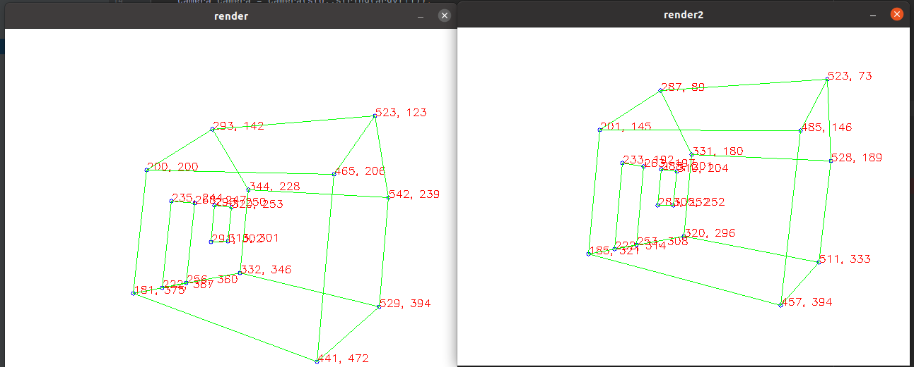

# Essential Matrix

This assignment provides you with a camera simulation environment. By loading a small house model and given the parameters and motion trajectory of the camera, we can obtain the projected image of the small house in the camera and the corresponding camera pose. .

This assignment requires everyone to implement two functions, EssentialMatrixFromPose and EssentialMatrixEightPointEstimate, in estimator/essential_matrix.cpp when the image matching of the camera is known. EssentialMatrixFromPose calculates the Essential matrix based on the known pose, and EssentialMatrixEightPointEstimate is the eight-point method. Method to solve the Essential matrix.

