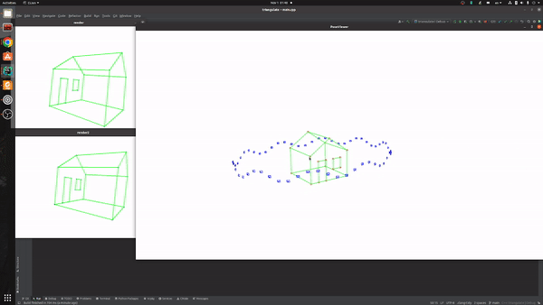

# Visual Slam Project Collection

This is a collection of my visual slam projects

[Camera Calibration](CameraCalibration/README.md)

[Triangulation](Triangulation/README.md)

[Gauss-Newton Curve Fitting](GaussNewton/README.md)

$$
\min \limits_{a,b,c} \frac{1}{2}\sum\limits_{i = 1}^N {{{\left\| {{y_i} - \exp \left( {ax_i^2 + bx_i + c} \right)} \right\|}^2}} .
$$

[VIO (Visual Odometry)](VIO/README.md)

[Bundle Adjustment](BundleAdjustment/README.md)

| Before optimization              | After optimization                |
|----------------------------------| --------------------------------- |
|  |  |

## 