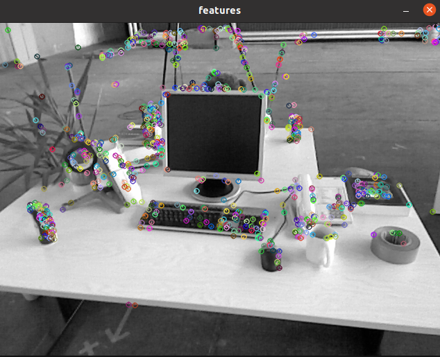
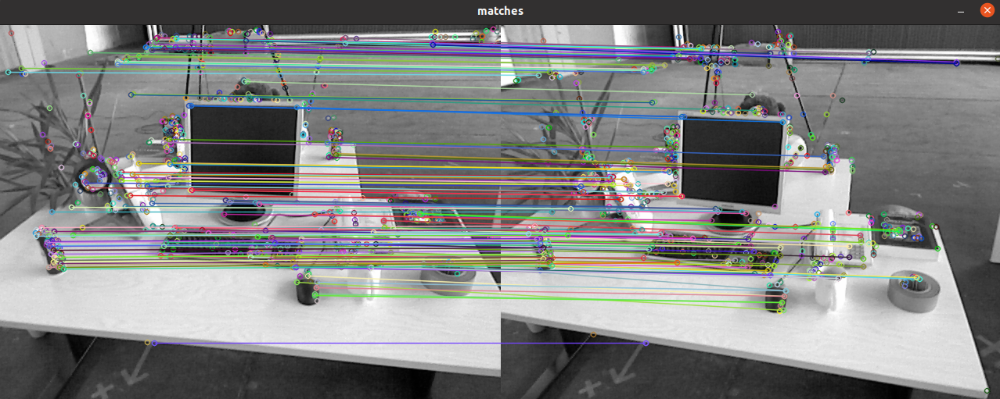

# VIO (Visual Odometry)

## Coding ORB features from scratch.

ORB features are also composed of two parts: *ORB key points* and *ORB descriptor*. Its key point is called **oriented FAST**, which is an improved version of the FAST. Its descriptor is called **BRIEF (Binary Robust Independent Elementary Feature)**. 

### FAST corner point extraction

Use Fast algorithm from OpenCV to extract fast corner points

### Compute Rotation

In terms of rotation, we calculate the gray centroid of the image near the feature point. The so-called centroid refers to the gray value of the image block as the center of weight.

1. In a small image block **B**, define the moment of the image block as:

$$
m_{pq}=\sum_{x,y \in B}x^{p}y^{q}I(x,y), \quad p, q = \{0,1\}.
$$

2. Calculate the centroid of the image block by the moment:

$$
C=\left(\frac{m_{10}}{m_{00}},\frac{m_{01}}{m_{00}}\right).
$$

3. Connect the geometric center $O$ and the centroid $C$ of the image block to get a direction vector $ \overrightarrow{OC}$ , so the direction of the feature point can be defined as:

$$
\theta = \arctan(m_{01}/m_{10}).
$$

FAST corner points have a description of scale and rotation, which significantly improves the robustness of their representation between different images. This improved FAST is called oriented FAST in ORB.

### Feature Matching

The simplest feature matching method is the brute-force matcher, which measures the distance between each pair of the features $x_{t}^{m}$ and all $x_{t+1}^{n}$ descriptors. Then sort the matching distance, and take the closest one as the matching point. The descriptor distance indicates the degree of similarity of two features. In practice, different distance metric norms can be used. For descriptors of floating-point type, using Euclidean distance to measure is a good choice. For binary descriptors (such as BRIEF), we often use Hamming distance as a metric. The Hamming distance between two binary vectors refers to the number of different digits.

### Result

Features:



Match result:



## Write a Gauss-Newton method for Bundle Adjustment to solve for PnP camera pose estimation
In this part, we only consider estimation of the camera's position and ignore observations' update.
Suppose given a set of 3D points $\textbf{P} = \{ \textbf{p}_i \}$.  Their coordinates in the camera image plane is 2d points  $\textbf{U} = \{ \textbf{u}_i \}$.  Suppose the intrinsic matrix is given:

$$
\textbf{K} = -\left[
\begin{array}{}
520.9  & 0 & 325.1 \\
0 & 521.0 & 249.7 \\
0 & 0 & 1
\end{array} \right]
$$

Find the optimal estimated pose matrix $\textbf{T}$.  Suppose the initial state is $\textbf{T} = \textbf{I}$

Remember the Gauss-Newton equation is:

$$
\underbrace{\mathbf{J} {\left( \mathbf{x} \right)} \mathbf{J}^T}_{\mathbf{H}(\mathbf{x})} \left( \mathbf{x} \right)\Delta \mathbf{x} =  \underbrace{- \mathbf{J} {\left( \mathbf{x} \right)} f\left( \mathbf{x} \right)}_{\mathbf{g}(\mathbf{x})}.
$$

The overall pipeline is the following:
```
for each iteration:
    cost = 0
    for each 3D-2D matching pair:
        compute error for p3d[I] and p2d[I]
        cost += error
        compute jacobian
        update matrix H
        update vector b
    solve for dx
    update estimation
    if converge, terminate early
```

### Result
```
points: 76
iteration 0 cost=645538.2282513
iteration 1 cost=12413.208557065
iteration 2 cost=12301.351931575
iteration 3 cost=12301.350653801
iteration 4 cost=12301.3506538
iteration 5 cost=12301.3506538
cost: 301.3506538, last cost: 301.3506538
estimated pose: 
   0.997866186837  -0.0516724392948   0.0399128072707   -0.127226620999
  0.0505959188721    0.998339770315   0.0275273682287 -0.00750679765283
  -0.041268949107  -0.0254492048094    0.998823914318   0.0613860848809
                0                 0                 0                 1
```

## BA using g2o
### Result
```
-- Max dist : 94.000000 
-- Min dist : 4.000000 
In total found79matching points
3d-2d pairs: 75
solve pnp in opencv cost time: 0.00030241 seconds.
R=
[0.9979059095501517, -0.05091940089119591, 0.03988747043579327;
 0.04981866254262534, 0.9983623157437967, 0.02812094175427922;
 -0.04125404886006491, -0.02607491352939112, 0.9988083912027803]
t=
[-0.1267821389545255;
 -0.00843949681832986;
 0.06034935748864372]
calling bundle adjustment by gauss newton
iteration 0 cost=40517.7576706
iteration 1 cost=410.547029116
iteration 2 cost=299.76468142
iteration 3 cost=299.763574327
pose by g-n: 
   0.997905909549  -0.0509194008562   0.0398874705187   -0.126782139096
   0.049818662505    0.998362315745   0.0281209417649 -0.00843949683874
 -0.0412540489424  -0.0260749135374    0.998808391199   0.0603493575229
                0                 0                 0                 1
solve pnp by gauss newton cost time: 0.008144349 seconds.
calling bundle adjustment by g2o
iteration= 0     chi2= 410.547029        time= 0.00174298        cumTime= 0.00174298     edges= 75       schur= 0
iteration= 1     chi2= 299.764681        time= 0.0017125         cumTime= 0.00345548     edges= 75       schur= 0
iteration= 2     chi2= 299.763574        time= 0.00183762        cumTime= 0.00529309     edges= 75       schur= 0
iteration= 3     chi2= 299.763574        time= 0.00168853        cumTime= 0.00698162     edges= 75       schur= 0
iteration= 4     chi2= 299.763574        time= 0.00169501        cumTime= 0.00867663     edges= 75       schur= 0
iteration= 5     chi2= 299.763574        time= 0.00171595        cumTime= 0.0103926      edges= 75       schur= 0
iteration= 6     chi2= 299.763574        time= 0.00169966        cumTime= 0.0120922      edges= 75       schur= 0
iteration= 7     chi2= 299.763574        time= 0.00168638        cumTime= 0.0137786      edges= 75       schur= 0
iteration= 8     chi2= 299.763574        time= 0.00171568        cumTime= 0.0154943      edges= 75       schur= 0
iteration= 9     chi2= 299.763574        time= 0.00174278        cumTime= 0.0172371      edges= 75       schur= 0
optimization costs time: 0.0202448 seconds.
pose estimated by g2o =
    0.99790590955  -0.0509194008911   0.0398874704367   -0.126782138956
  0.0498186625425    0.998362315744   0.0281209417542 -0.00843949681823
 -0.0412540488609  -0.0260749135293    0.998808391203   0.0603493574888
                0                 0                 0                 1
solve pnp by g2o cost time: 0.020437729 seconds.
```